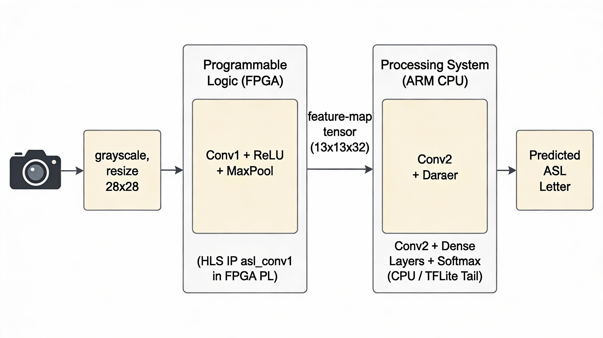
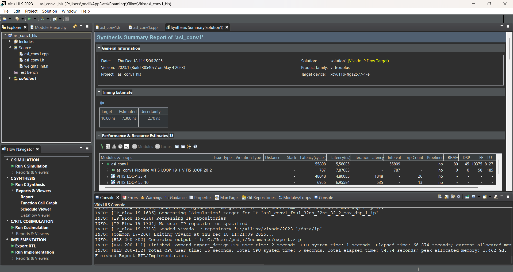
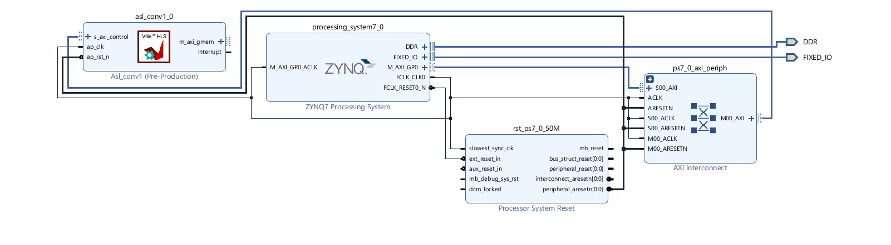
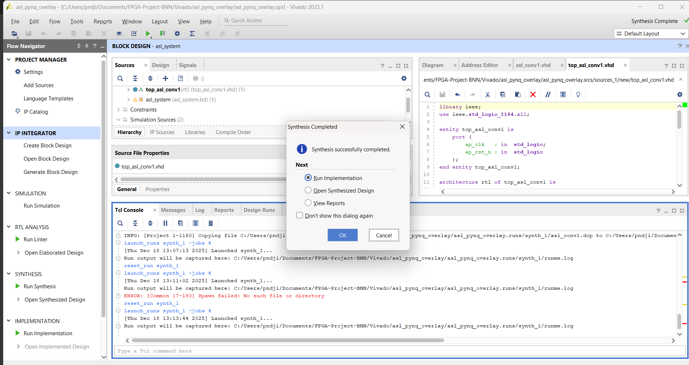
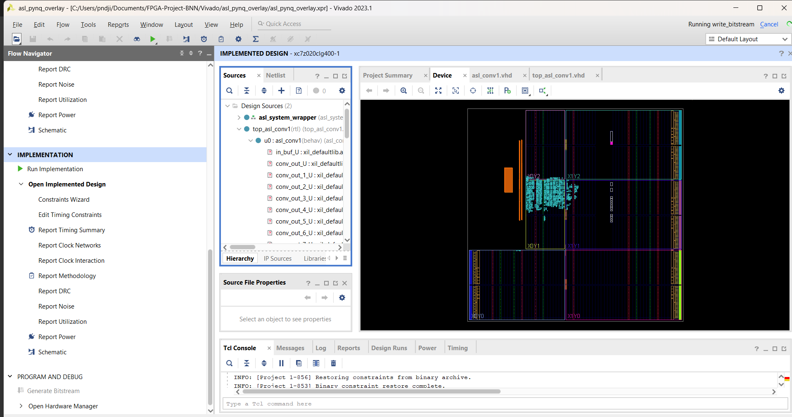
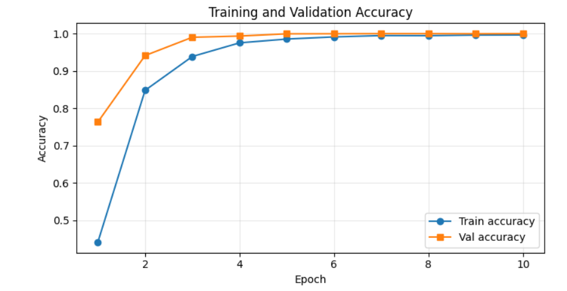

# FPGA-Accelerated Real-Time ASL Alphabet Recognition  
**AI Hardware Final Project – Hardware/Software Co-Design**

---

## Team Members
- **Maïva Ndjiakou Kaptue**
- **Wil Berling**
- **Daniel Lee**

---

## Project Motivation
Sign language recognition is a critical human–computer interaction problem with strong relevance to **accessibility, assistive technologies, and inclusive design**. Real-time interpretation of hand gestures requires both high classification accuracy and **low, stable inference latency**.

While deep learning models achieve excellent accuracy, most implementations rely on **general-purpose CPUs or GPUs**. CPUs often exhibit **latency jitter** due to operating system scheduling and shared resources, which degrades real-time user experience and limits deployment in embedded systems.

This project explores **FPGA-based acceleration** as a practical solution to:
- Reduce inference latency variability  
- Improve execution determinism  
- Enable deployment on embedded and low-power platforms  

We go beyond a pure software prototype and build a complete **hardware-aware ML pipeline**: dataset → CNN → HLS accelerator → Vivado overlay → PYNQ runtime and benchmarking.

---

## Project Overview
This project implements a real-time **American Sign Language (ASL) alphabet recognition system** and evaluates two execution platforms:

1. **PC-based software baseline (CPU-only)**
2. **FPGA-accelerated embedded system using the PYNQ-Z1 board**

A convolutional neural network (CNN) is trained to classify ASL hand gestures from grayscale images. The trained model is **partially offloaded to FPGA hardware** by accelerating the first convolutional block using a **custom HLS-generated IP core**, while the remaining layers execute on the ARM processor.

Key contributions:
- A compact ASL CNN trained on the Kaggle ASL Alphabet dataset  
- A Vitis HLS implementation of the first convolutional block (Conv1 + ReLU + MaxPool)  
- A Vivado Zynq block design and PYNQ overlay (`asl_system`)  
- A CPU-only baseline and a CPU+FPGA deployment with **measured** accuracy, latency, and jitter  
- Numerical validation of the hardware Conv1 output against the software reference

---

## System Architecture

### End-to-End Pipeline
1. Camera frame acquisition  
2. Image preprocessing (grayscale, resizing to 28×28)  
3. CNN inference  
4. ASL letter prediction  

### Hardware / Software Partition
- **CPU baseline:** Entire CNN executed on the host CPU  
- **FPGA-accelerated path:**
  - Conv1 + ReLU + MaxPool on FPGA programmable logic (`asl_conv1` IP)  
  - Remaining CNN layers on ARM processor (TensorFlow Lite “tail” model)  

  

This partition captures the most compute-intensive early convolution in hardware while keeping later layers flexible and easy to modify in software.

---

## Dataset and Preprocessing
- **Dataset:** ASL Alphabet Dataset (Kaggle)
- **Image format:** 28×28 grayscale
- **Classes:** 25 ASL alphabet letters  

During training and evaluation:
- Images are normalized to [0, 1] and reshaped to `(28, 28, 1)`.  
- The dataset is split into training, validation, and test subsets.

During real-time inference:
- A webcam frame is captured.  
- A hand region of interest is cropped, converted to grayscale, and resized to 28×28.  
- The exact same normalization is applied before feeding the CNN.

Using a shared preprocessing pipeline for both CPU and FPGA execution enables a **direct, fair comparison** of accuracy and latency.

---

## Neural Network Model
The CNN architecture is optimized for low-resolution grayscale input:

- Conv(32, 3×3) → ReLU → MaxPool  
- Conv(64, 3×3) → ReLU → MaxPool  
- Dense(128) → ReLU  
- Dense(25) → Softmax  

  

This model achieves high classification accuracy with a modest parameter count, making it suitable for both desktop and embedded deployment.

---

## Implementation

### PC-Based Software Baseline
- Implemented in **Python + TensorFlow/Keras**  
- Used for:
  - Training and hyperparameter tuning  
  - Visualizing training/validation curves  
  - Establishing a CPU-only baseline for accuracy, latency, and throughput  
- Also exports:
  - ONNX model for inspection  
  - Conv1 weights/biases for the HLS accelerator  
  - A TFLite “tail” model (Conv2 + FC layers) used on the ARM CPU

---

### FPGA-Based Implementation (PYNQ-Z1)

#### HLS Accelerator Design
The first convolutional block is implemented as a **custom Vitis HLS IP core** using weights exported from the trained Keras model.

  

- Top function: `void asl_conv1(float *in, float *out);`  
- Interfaces:
  - AXI4 master for input and output feature maps (bundle `gmem`)  
  - AXI4-Lite for control and buffer addresses  
- Functionality:
  - 3×3 convolution with 32 filters  
  - ReLU activation  
  - 2×2 max pooling to produce a 13×13×32 output feature map  

#### Vivado Integration
The HLS IP is integrated into a Zynq block design and synthesized for the PYNQ-Z1 FPGA.

  

The block design connects:
- `asl_conv1` to the ARM PS via AXI4-Lite  
- Its AXI4 master port to DDR through S_AXI_HP0 and AXI Interconnect  
- Clock and reset signals from `processing_system7_0` and `rst_ps7_0_50M`

#### FPGA Synthesis and Implementation

  

  

**Resource utilization of `asl_conv1` (xc7z020):**
- LUTs: 681 / 53,200 (1.28%)  
- FFs: 4,791 / 106,400 (4.50%)  
- BRAM: 0 / 140 (0.00%)  
- DSP: 0 / 220 (0.00%)

The accelerator is extremely lightweight, demonstrating that meaningful speedups can be achieved with minimal FPGA resource cost.

---

## Results and Benchmarking

### CPU Baseline Results
- High validation and test accuracy (≈ 98% top-1).  
- Mean inference latency ≈ **83.521 ms**.  
- Standard deviation ≈ **29.625 ms**.  
- Throughput ≈ **11.97 FPS** (batch size 1).  
- Noticeable latency variability (jitter) due to OS scheduling and shared resources.

  

  
  

These plots show that the CPU-only implementation is accurate but operates near the lower bound of “smooth” real-time performance, with occasional slow frames.

---

### FPGA Results

#### Numerical Correctness of `asl_conv1`
We compare Conv1+ReLU+MaxPool feature maps produced in software vs. hardware for the same ASL input:

- MSE (HW vs SW): **9.9 × 10⁻⁷**  
- MAE: **7.9 × 10⁻⁴**  
- Max |difference|: **4.5 × 10⁻³**

  

All errors are tiny (well below 10⁻²), confirming that the FPGA accelerator is numerically faithful to the reference layer and justifying its use inside the end-to-end pipeline.

#### End-to-End Accuracy: CPU vs CPU+FPGA

  

- **CPU only:** 98.24% test accuracy  
- **CPU+FPGA:** 98.44% test accuracy  

Offloading Conv1 to hardware does **not** degrade recognition performance; if anything, the small difference is within normal statistical variation.

#### Latency and Throughput: CPU vs CPU+FPGA

  

Measured over 500 single-frame inferences:

| Metric                  | CPU only | CPU+FPGA |
|-------------------------|---------:|---------:|
| Mean latency (ms)       | 83.81    | 28.18    |
| Latency std. dev. (ms)  | 29.11    | 8.58     |
| Throughput (FPS)        | 11.93    | 35.49    |

**Key takeaways:**
- ≈ **3× reduction in mean latency** when Conv1 is offloaded to FPGA.  
- ≈ **3× reduction in latency jitter**, leading to more deterministic frame times.  
- **Throughput improves from ~12 FPS to ~35 FPS**, comfortably above real-time video rates.

These results clearly show that the CPU+FPGA design provides a **substantial performance boost** while preserving accuracy and using only a small fraction of the device.

---

## HowTo: Use the Software with the Hardware Platform (PYNQ-Z1)

> This section explains how to use the software together with the hardware platform. It can be followed by anyone reproducing the project.

### Requirements
- PYNQ-Z1 board with a PYNQ image flashed to SD card  
- Micro-USB cable (power + UART)  
- Ethernet cable (board ↔ router or switch)  
- Host PC on the same network (Wi-Fi is fine)  
- Serial terminal (e.g., **MobaXterm** on Windows)  
- Web browser (Chrome/Edge/Firefox)

### Step 1 – Connect and Boot the Board
1. Set boot mode to **SD** (JP4 jumper on SD position).  
2. Insert the SD card with the PYNQ image.  
3. Connect the micro-USB cable (PROG-UART) to the PC.  
4. Connect Ethernet from the board to the router/switch.  
5. Power on the board and wait for the boot LEDs to stabilize.

### Step 2 – Access the Board via Serial
1. Open **Device Manager** (Windows) and find the COM port (e.g., `COM9`).  
2. Open **MobaXterm → Session → Serial** and configure:
   - Port: `COM9` (or your port)  
   - Baud: `115200`  
3. Connect; you should see the PYNQ Linux shell.

### Step 3 – Get the Board IP
In the serial terminal:
